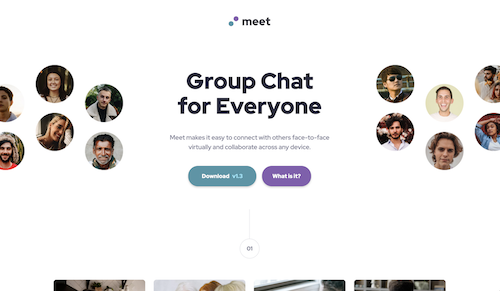
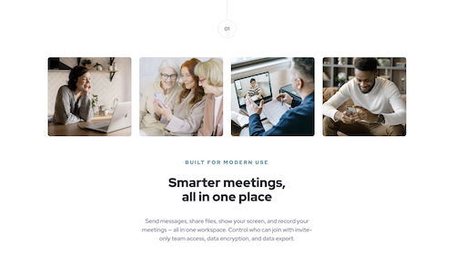
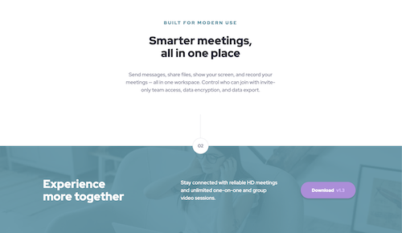
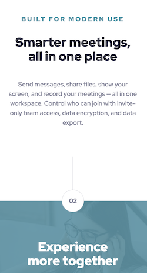

# Frontend Mentor - Meet landing page solution

This is a solution to the [Meet landing page challenge on Frontend Mentor](https://www.frontendmentor.io/challenges/meet-landing-page-rbTDS6OUR). Frontend Mentor challenges help you improve your coding skills by building realistic projects.

## Table of contents

- [Overview](#overview)
  - [The challenge](#the-challenge)
  - [Screenshots](#screenshots)
  - [Links](#links)
- [My process](#my-process)
  - [Built with](#built-with)
  - [Useful resources](#useful-resources)
- [Author](#author)
- [Acknowledgments](#acknowledgments)

## Overview

### The challenge

Users should be able to:

- View the optimal layout depending on their device's screen size
- See hover states for interactive elements

### Screenshots

### Links

- Solution URL: [Frontend Mentor](https://jasoneczek-meet-landing-page.netlify.app/)
- Live Site URL: [Live Site](https://jasoneczek-meet-landing-page.netlify.app/)

## My process

### Built with

- Semantic HTML5 markup
- CSS custom properties
- Flexbox
- CSS Grid
- Mobile-first workflow

### Useful resources

- [Modern CSS - CSS Button Styling Guide](https://moderncss.dev/css-button-styling-guide/)
- [Modern Fluid Typography Using CSS Clamp](https://www.smashingmagazine.com/2022/01/modern-fluid-typography-css-clamp/)

## Author

- Github - [@jasoneczek](https://github.com/jasoneczek)
- Frontend Mentor - [@jasoneczek](https://www.frontendmentor.io/profile/jasoneczek)

## Acknowledgments

Thank you [Frontend Mentor](https://www.frontendmentor.io) for creating this challenge.
